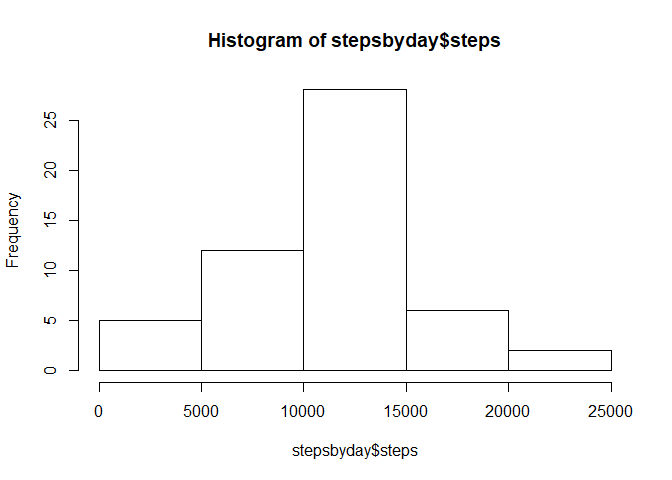
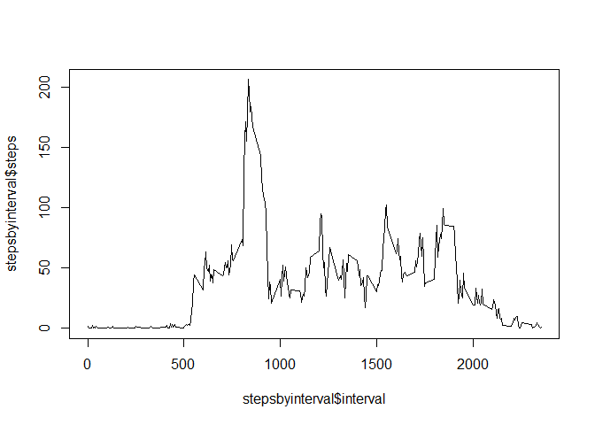
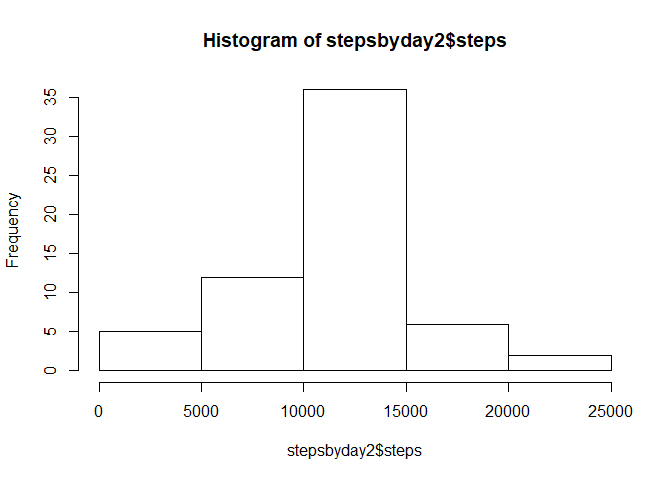
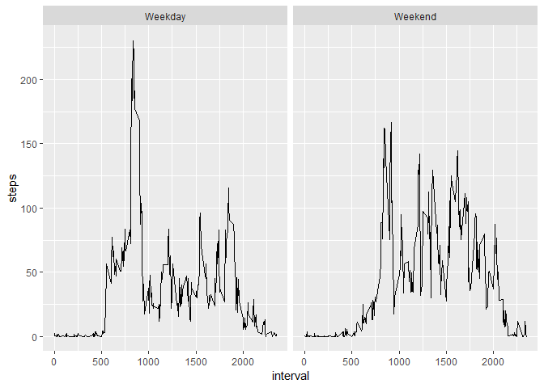

#My assessment

**We are going to read the data from the activity csv file.**


```r
setwd("C:/Users/Hchazelle/Desktop/Coursera/ReproducibleResearch/RepData_PeerAssessment1")
if(!file.exists("activity.csv")){
        unzip(zipfile = "activity.zip")
}
myData <- read.csv("activity.csv", header=TRUE, sep=",")
```

**Now we will transform the data to make our histogram using dplyr.**


```r
library(dplyr)
```

```
## Warning: package 'dplyr' was built under R version 3.5.1
```

```
## 
## Attaching package: 'dplyr'
```

```
## The following objects are masked from 'package:stats':
## 
##     filter, lag
```

```
## The following objects are masked from 'package:base':
## 
##     intersect, setdiff, setequal, union
```

```r
stepsbyday <- group_by(myData, date)
stepsbyday<- summarise_all(stepsbyday, sum)
hist(stepsbyday$steps)
```

<!-- -->

**Calculate and report mean and median of the total number of steps taken per day**


```r
mean(stepsbyday$steps, na.rm=TRUE)
```

```
## [1] 10766.19
```

```r
median(stepsbyday$steps, na.rm=TRUE)
```

```
## [1] 10765
```

**Make time series plot of the 5-minute interval (X) and the average number of steps taken,  **
**averaged across all days (Y)**


```r
stepsbyinterval <- group_by(add=FALSE, .data = myData, interval)
stepsbyinterval <- select(stepsbyinterval, interval, steps)
stepsbyinterval <- summarise_all(stepsbyinterval, mean, na.rm=TRUE)
plot(x = stepsbyinterval$interval, y= stepsbyinterval$steps, type = "line")
```

```
## Warning in plot.xy(xy, type, ...): plot type 'line' will be truncated to
## first character
```

<!-- -->

**Which 5-minute interval, on average across all days contains the max number of steps**

```r
stepsbyinterval[stepsbyinterval$steps == max(stepsbyinterval$steps),]
```

```
## # A tibble: 1 x 2
##   interval steps
##      <int> <dbl>
## 1      835  206.
```
**Calculate and report the total number of missing values in the dataset**


```r
summary(complete.cases(myData))
```

```
##    Mode   FALSE    TRUE 
## logical    2304   15264
```

**Filling missing values**

```r
myData2 <- myData
for (j in 1:288){
        for(i in seq_along(myData2$interval)){
                if (is.na(myData2$steps[i]) & myData2$interval[i]==stepsbyinterval$interval[j]){
                        myData2$steps[i] = stepsbyinterval$steps[j]
                }
        }
}
```

**Make historgram of total number of steps taken each day**

```r
stepsbyday2 <- group_by(myData2, date)
stepsbyday2 <- summarise_all(stepsbyday2, sum)
hist(stepsbyday2$steps)
```

<!-- -->

**Calculate and report mean and median**

```r
mean(stepsbyday2$steps, na.rm=TRUE)
```

```
## [1] 10766.19
```

```r
median(stepsbyday2$steps, na.rm=TRUE)
```

```
## [1] 10766.19
```

*Only the median has slightly changed to match the mean*

**Create a new variable WeekdaysEnd to segregate our data between weekdays and weekends**

```r
myData2$WeekdaysEnd <- ifelse(weekdays(as.Date(myData2$date))=="Saturday" | weekdays(as.Date(myData2$date))=="Sunday", "Weekend", "Weekday")
```

**Make a panel plot using ggplot2 by weekdays and weekend days**

```r
library(ggplot2)
```

```
## Warning: package 'ggplot2' was built under R version 3.5.1
```

```r
steps <- select(myData2, interval, WeekdaysEnd, steps)
steps <- group_by(steps, interval, WeekdaysEnd)
steps <- summarise_all(steps, mean)
qplot(x = interval, y= steps, data= steps, facets= .~WeekdaysEnd, geom="line")
```

<!-- -->


    
